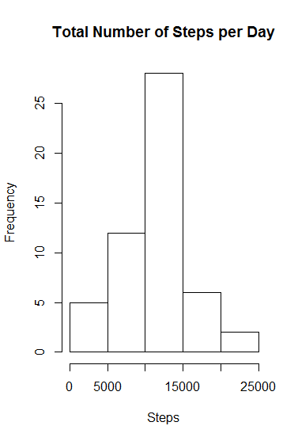
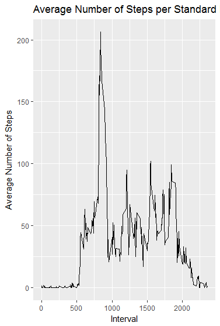
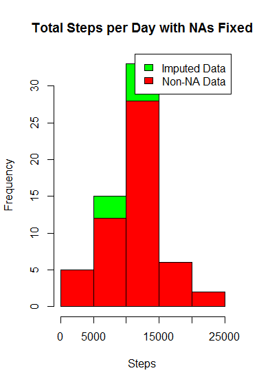
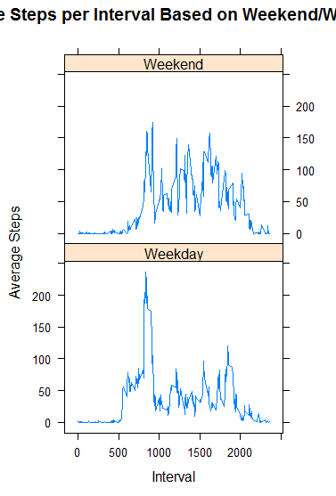

This is an R Markdown document. Markdown is a simple formatting syntax
for authoring HTML, PDF, and MS Word documents. For more details on
using R Markdown see <http://rmarkdown.rstudio.com>.

Reproducible Research: Peer Assessment 1
========================================

Loading Data and Packages

    library(ggplot2)
    library(plyr)
    activity <- read.csv("activity.csv")

Setting Parameters and Processing

    activity$day <- weekdays(as.Date(activity$date))
    activity$DateTime <- as.POSIXct(activity$date,format="%Y-%m-%d")

Remove the NA selections

    clean <- activity[!is.na(activity$steps),]

What is the mean of the total number of steps take per day?

    sumTable <- aggregate(activity$steps ~ activity$date, FUN=sum,)
    colnames(sumTable)<- c("Date", "Steps")

Building the Histogram for the question concerning mean

    Chart1 <- hist(sumTable$Steps, breaks=5, xlab="Steps", main= "Total Number of Steps per Day")

<!-- -->

Time to Calculate Mean

    as.integer(mean(sumTable$Steps))

    ## [1] 10766

Now for the Median

    as.integer(median(sumTable$Steps))

    ## [1] 10765

We get 10766 for the mean and 10765 for the median

Now it's time for the determining daily activity

    intervalTable <- ddply(clean, .(interval), summarize, Avg = mean(steps))
    p <- ggplot(intervalTable, aes(x=interval, y=Avg), xlab = "Interval", ylab = "Average Number of Steps")
    p + geom_line()+xlab("Interval")+ylab("Average Number of Steps")+ggtitle("Average Number of Steps per Standard Interval")

<!-- -->

Determining which 5 min. interval has the max number of steps

    maxSteps <- max(intervalTable$Avg)
    intervalTable[intervalTable$Avg==maxSteps,1]

    ## [1] 835

We get 835 for the 5 minute interval which had 206 steps

We now need to determine the extent of missing values

    nrow(activity[is.na(activity$steps),])

    ## [1] 2304

We now see that there are 2304 missing values

We are now tasked with filling these holes. In this instance I like the
idea of using 5 min avgs.based on the day

    avgTable <- ddply(clean, .(interval, day), summarize, Avg = mean(steps))
    nadata <- activity[is.na(activity$steps),]
    newdata <- merge(nadata, avgTable, by=c("interval", "day"))

Now for a new set with the holes filled in

    newdata2 <- newdata[,c(6,4,1,2,5)]
    colnames(newdata2) <- c("steps", "date", "interval", "day", "DateTime")
    mergeData <- rbind(clean, newdata2)

Now we need to start setting up a new histogram with total steps, mean,
and median. We need to measure the difference.

    sumTable2 <- aggregate(mergeData$steps ~ mergeData$date, FUN =sum,)
    colnames(sumTable2) <- c("Date", "Steps")
    as.integer(mean(sumTable2$Steps))

    ## [1] 10821

One more calculation

    as.integer(median(sumTable2$Steps))

    ## [1] 11015

so now we get 10821 for the mean and 11015 for the median

Time to build the histogram

    chart3 <- hist(sumTable2$Steps, breaks=5, xlab="Steps", main = "Total Steps per Day with NAs Fixed", col="green")
    hist(sumTable$Steps, breaks=5, xlab="Steps", main = "Total Steps per Day with NAs Fixed", col="red", add=T)
    legend("topright", c("Imputed Data", "Non-NA Data"), fill=c("green", "red") )

<!-- -->

With this histogram we get a better idea: The mean stands at 10821 as
opposed to the original 10766 and the median stands at 11015 as opposed
to 10765. We have a difference of 55 and 250 respectively but the
general nature of the distribution holds true.

    mergeData$DayCategory <- ifelse(mergeData$day %in% c("Saturday", "Sunday"), "Weekend", "Weekday")

time to build

    library(lattice)
    intervalTable2 <- ddply(mergeData, .(interval, DayCategory), summarize, Avg = mean(steps))
    xyplot(Avg~interval|DayCategory, data=intervalTable2, type="l",  layout = c(1,2),
           main="Average Steps per Interval Based on Weekend/Weekday", 
           ylab="Average Steps", xlab="Interval")

<!-- -->

Now we see that activity levels vary considerably between Weekends and
standard weekdays. This is probably due to the amount of leisure time
available to people during the off days.
